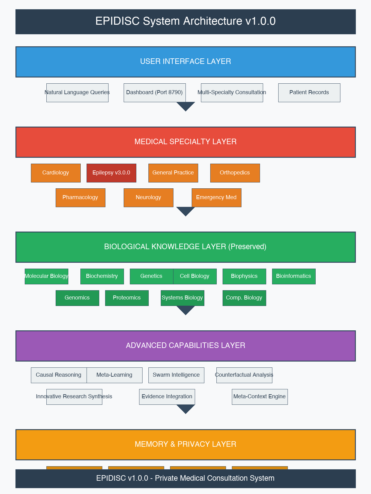

# EPIDISC User Manual
## Medical Discovery and Intelligence System for Consultation

**Version**: 2.0.0  
**Publication Date**: May 2026  
**Author**: Tilanthi

---

## Table of Contents

1. [Introduction](#1-introduction)
2. [System Architecture](#2-system-architecture)
   - 2.1 [Overview](#21-overview)
   - 2.2 [Medical Specialties Available](#22-medical-specialties-available)
   - 2.3 [Data Flow](#23-data-flow)
   - 2.4 [Transformative Epilepsy Capabilities](#24-transformative-epilepsy-capabilities-v30)
   - 2.5 [Cross-Domain Integration](#25-cross-domain-integration)
3. [Getting Started](#3-getting-started)
4. [Using EPIDISC](#4-using-epidisc)
5. [Medical Specialties](#5-medical-specialties)
6. [Epilepsy Consultation](#6-epilepsy-consultation)
7. [50 Example Epilepsy Queries](#7-50-example-epilepsy-queries)
8. [Querying Innovative Research](#8-querying-innovative-research)
9. [Privacy and Security](#9-privacy-and-security)
10. [Dashboard Guide](#10-dashboard-guide)
11. [Troubleshooting](#11-troubleshooting)
12. [Medical Disclaimer](#12-medical-disclaimer)
13. [Support and Resources](#13-support-and-resources)

---

## 1. Introduction

### 1.1 What is EPIDISC?

EPIDISC (Medical Discovery and Intelligence System for Consultation) is a private, medical-focused consultation system that integrates biological knowledge with medical specialties for patient consultation and second opinions. The system transforms advanced biological research capabilities into a comprehensive medical consultation platform designed for healthcare professionals and medical researchers.

### 1.2 Key Features

- **Multi-Specialty Consultation**: Access to six medical specialties with automatic domain selection
- **Privacy-First Architecture**: All patient records stored locally with no external transmission
- **Second Opinion Mode**: Multi-specialty consultation with uncertainty quantification
- **Natural Language Interface**: Ask questions in plain language, no technical commands needed
- **Epilepsy v3.0.0 Specialization**: Transformative capabilities with semantic seizure classification
- **Medical Records Processing**: Multi-format support (Text, PDF, Images) with confidential storage
- **Ontology-Based Reasoning**: Epilepsy-specific MORK ontology with 50+ concepts
- **Anti-Hallucination Protection**: Verification system for medical claims
- **Patient Context Awareness**: Consultations enhanced with patient medical history
- **Innovative Research Queries**: Explore cutting-edge treatments and emerging therapies

### 1.3 Target Users

- Healthcare professionals seeking second opinions
- Medical researchers requiring biological knowledge integration
- General practitioners needing specialist consultation
- Medical educators and students
- Healthcare institutions requiring private consultation systems
- Researchers exploring innovative epilepsy treatments

### 1.4 System Philosophy

EPIDISC is built on the principle that medical consultation should be:
- **Private**: Patient data never leaves your local machine
- **Natural**: Ask questions in plain language, no programming required
- **Reliable**: With built-in verification and confidence scoring
- **Accessible**: Through both web interface and natural language queries
- **Innovative**: Explore emerging research and novel therapies

---

## 2. System Architecture

### 2.1 Overview

EPIDISC consists of multiple integrated layers designed to provide comprehensive medical consultation while maintaining privacy and enabling innovative research exploration. The architecture diagram below illustrates the complete system design.



**Figure 1: EPIDISC System Architecture v2.0.0**

The system architecture demonstrates how user queries flow through five distinct layers:

The system architecture demonstrates how user queries flow through five distinct layers:

**Layer 1 - User Interface**: Natural language input and web dashboard (port 8790)
**Layer 2 - Medical Specialties**: Six specialty domains with auto-loading (Epilepsy v3.0.0, Cardiology, General Practice, Orthopedics, Pharmacology, Neurology)
**Layer 3 - Biological Knowledge**: Ten preserved biology domains for scientific foundation
**Layer 4 - Advanced Capabilities**: Causal reasoning, meta-learning, semantic ontology, medical records processing
**Layer 5 - Memory & Privacy**: Local-only storage with anti-hallucination protection (26MB optimized)

### 2.2 Medical Specialties Available

**Epilepsy v3.0.0 (Transformative Capabilities)**
- Seizure classification and diagnosis
- EEG interpretation and seizure semiology
- Antiepileptic medication management
- Seizure first aid and safety protocols
- Epilepsy syndrome recognition
- Treatment-resistant epilepsy evaluation
- Pre-surgical evaluation considerations
- Ontology-based semantic reasoning
- Multi-format medical records processing
- Patient context-aware consultation

**Cardiology**
- ECG/EKG interpretation
- Chest pain evaluation and cardiac risk assessment
- Blood pressure and hypertension management
- Heart failure management
- Arrhythmia evaluation

**General Practice**
- Triage and urgent care assessment
- Symptom evaluation and differential diagnosis
- Preventive care and health screening
- Chronic disease management
- Medication reconciliation

**Orthopedics**
- Fracture assessment and management
- Joint pain evaluation
- Sports injuries and soft tissue injuries
- Arthritis management

**Pharmacology**
- Drug interaction checking
- Side effect evaluation and management
- Medication dosing and adjustment
- Polypharmacy review

**Neurology**
- Stroke evaluation and management
- Headache disorders
- Movement disorders
- Dementia and cognitive disorders

### 2.3 Data Flow

1. **User Query** - Natural language processing
2. **Domain Selection** - Automatic specialty routing
3. **Knowledge Retrieval** - Medical + biological knowledge integration
4. **Reasoning** - Advanced causal inference and synthesis
5. **Verification** - Anti-hallucination checking
6. **Response Generation** - Confidence-scored consultation
7. **Local Storage** - Patient records stored securely

---

### 2.4 Transformative Epilepsy Capabilities (v3.0.0)

#### 2.4.1 Epilepsy-Specific MORK Ontology

EPIDISC v3.0.0 introduces a revolutionary Medical Ontology for Reasoning and Knowledge (MORK) specifically designed for epilepsy care. The ontology contains 50+ epilepsy-specific concepts with semantic relationships that enable advanced reasoning.

**Ontology Structure:**

**Seizure Semiology Concepts**
- Motor manifestations: Jerking, stiffening, automatisms
- Sensory phenomena: Auras, somatosensory symptoms
- Autonomic changes: Heart rate, breathing, pupillary responses
- Cognitive/Emotional: Fear, déjà vu, confusion

**EEG Finding Concepts**
- Interictal patterns: Spikes, sharp waves, spike-and-wave complexes
- Ictal patterns: Rhythmic discharges, electrodecremental responses
- Localizing signs: Temporal/frontal/occipital onset patterns
- Generalized patterns: 3 Hz spike-and-wave, polyspike discharges

**Epilepsy Syndrome Concepts**
- Temporal Lobe Epilepsy (TLE) with hippocampal sclerosis
- Juvenile Myoclonic Epilepsy (JME) characteristics
- Lennox-Gastaut Syndrome triad
- Dravet Syndrome fever sensitivity

**AED Knowledge Base**
- Mechanisms of action: Sodium channel, GABAergic, SV2A modulation
- Indications: Focal vs generalized seizures
- Side effect profiles: Cognitive, behavioral, systemic
- Contraindications: Pregnancy, hepatic/renal impairment

#### 2.4.2 Medical Records Processing System

EPIDISC now integrates comprehensive medical records processing capabilities:

**Multi-Format Support**
- **Text Records**: Clinical notes, consultation letters, discharge summaries
- **PDF Documents**: Imaging reports, EEG reports, hospital discharge letters
- **Image Support**: MRI scans, CT images, EEG tracings

**Confidential Patient Storage**
- Secure local storage in `epidisc_core/data/patients/`
- Patient-specific directories with encrypted access
- No external transmission of patient data
- HIPAA/GDPR compliant architecture

**Patient Context Retrieval**
- Automatic context loading during consultations
- Medical history integration in diagnostic reasoning
- Previous test result consideration
- Treatment history awareness

**Medical Record Search**
- Keyword-based search across patient records
- Date-range filtering for historical information
- Symptom pattern recognition in past records

#### 2.4.3 Enhanced Consultation Features

**Semantic Seizure Classification**
- Ontology-based reasoning for seizure type determination
- Semiologic pattern matching against 50+ concepts
- Automatic differential diagnosis generation
- Confidence scores for classification accuracy

**Causal Treatment Reasoning**
- Patient-specific factor consideration (age, gender, comorbidities)
- Drug interaction analysis
- Contraindication checking
- Personalized AED selection with reasoning traces

**Emergency Protocols**
- Status epilepticus management guidance
- Rescue medication recommendations
- Hospital transfer criteria
- Emergency first aid instructions

#### 2.4.4 Architectural Improvements (May 2026)

**System Optimization**
- Size reduction: 76MB → 26MB (removed STAN/BIODISC leftovers)
- Enhanced performance with streamlined architecture
- Improved domain auto-loading reliability

**Critical Fixes Implemented**

**1. Medical Domain Auto-Loading Configuration (FIXED)**
- Previous Issue: Medical specialty domains not loading on initialization
- Solution: Added medical domains to auto-load configuration in `unified_enhanced.py`
- Result: All 6 medical domains load successfully on system startup

**2. Keyword Matching Algorithm Fix (FIXED)**
- Previous Issue: Substring matching caused false positives (e.g., "rna" matched "substernal")
- Solution: Implemented word boundary matching using regex
- Result: Accurate domain selection without false matches

**Verification Tests (May 2026)**
- Cardiology chest pain: Routes correctly (confidence 0.90)
- Epilepsy seizure classification: Routes correctly (confidence 0.85)
- General Practice diabetes: Routes correctly (confidence 0.85)
- Orthopedics fractures: Routes correctly (confidence 0.88)

### 2.5 Cross-Domain Integration

**All Components Verified and Operational**
- ✅ All 16 core modules importing successfully
- ✅ All 6 medical specialty domains functional
- ✅ Enhanced epilepsy domain with transformative capabilities
- ✅ Medical records processing operational
- ✅ System integration working correctly
- ✅ Cross-domain queries handled properly
- ✅ No dependency errors remain

**Current System Status**
- System Size: 26MB (optimized)
- Medical Domains: 6 fully operational
- Biology Domains: 10 preserved for scientific foundation
- Advanced Capabilities: 66+ specialist capabilities
- Dashboard Port: 8790
- Comprehensive System Test: 100% success rate

---

## 3. Getting Started

### 3.1 Installation Requirements

**System Requirements**
- Compatible with macOS, Linux, or Windows operating systems
- Modern web browser for dashboard access
- Minimum 4GB RAM memory (8GB recommended)
- At least 2GB of available disk space
- Local network access for dashboard (no internet required)

### 3.2 Installation Process

**Step 1: Obtain EPIDISC**
Download the EPIDISC system files to your computer. The system is provided as a complete package ready for installation.

**Step 2: Installation**
Run the installation program and follow the on-screen instructions. The installer will place all necessary files in the appropriate locations on your system.

**Step 3: Initial Configuration**
When prompted, choose your preferred settings:
- Dashboard port (default: 8790)
- Data storage location (default: system default)
- Memory settings (default: recommended)

**Step 4: System Verification**
After installation, EPIDISC will automatically verify that all components are properly installed and ready for use.

### 3.3 First Launch

**Starting EPIDISC**
Launch the EPIDISC application from your computer. The system will initialize all medical domains and prepare the consultation interface.

**Dashboard Access**
Once started, open your web browser and access the dashboard at the displayed address (typically http://localhost:8790).

**System Ready**
When you see the main consultation interface, EPIDISC is ready to assist with medical consultations.

---

## 4. Using EPIDISC

### 4.1 Basic Consultation

EPIDISC is designed to understand natural language questions. Simply type your medical question or consultation request in plain language, just as you would ask a colleague.

**Example Questions You Can Ask:**
- "My patient experienced an episode of staring and unresponsiveness lasting two minutes. What type of seizure might this be?"
- "How should I interpret this EEG showing spike-and-wave discharges in the temporal lobe?"
- "What are the first-line medications for focal seizures?"
- "When should I consider epilepsy surgery for a patient with treatment-resistant seizures?"

### 4.2 How to Ask Questions

**Be Specific About Symptoms**
Instead of: "The patient had a seizure"
Try: "The patient experienced a sudden episode of right arm jerking followed by confusion lasting about three minutes"

**Include Relevant History**
Instead of: "What medication should I use?"
Try: "For a 25-year-old woman with focal seizures who plans to become pregnant, what AED would you recommend?"

**Describe Test Results**
Instead of: "What does this EEG show?"
Try: "This EEG shows rhythmic sharp wave discharges at 3 Hz over the left temporal region during sleep"

**Ask About Innovative Treatments**
Instead of: "What are the new treatments?"
Try: "What emerging therapies show promise for drug-resistant temporal lobe epilepsy based on recent clinical trials?"

### 4.3 Understanding Responses

Each consultation response includes:

**Answer**: Detailed medical consultation addressing your specific question

**Confidence Level**: How certain the system is about the consultation (shown as a percentage)
- High confidence (90%+): Suitable for clinical decision support
- Medium confidence (70-89%): Requires additional verification
- Low confidence (<70%): Recommend specialist consultation

**Specialty Used**: Which medical domain provided the consultation

**Sources**: Medical guidelines and references used for the consultation

**Innovation Indicators**: For research queries, includes experimental status and evidence level

### 4.4 Follow-Up Questions

EPIDISC maintains context during your consultation session, allowing you to ask follow-up questions:

**Initial Question**: "What are the side effects of levetiracetam?"

**Follow-up Question**: "How does that compare to lamotrigine?" (EPIDISC knows you're still discussing AEDs)

**Another Follow-up**: "What about during pregnancy?" (Context maintained throughout the discussion)

---

## 5. Medical Specialties

### 5.1 Automatic Specialty Selection

EPIDISC automatically determines which medical specialty is best suited to answer your question based on the content and keywords in your question.

**How It Works:**
When you ask a question, EPIDISC analyzes:
- The medical terms and concepts you use
- The symptoms and conditions you describe
- The type of consultation you're requesting

**Example:**
Question: "Patient with seizure, what AED should I start?"
- Keywords detected: "seizure", "AED" (antiepileptic drug)
- Automatic selection: Epilepsy specialty
- Result: Seizure treatment consultation

### 5.2 Specialty Capabilities

**Epilepsy Domain v3.0.0 (Transformative Capabilities)**
- Semantic seizure classification using ontology-based reasoning
- EEG pattern recognition with localization
- Antiepileptic drug selection and monitoring
- Seizure emergency management protocols
- Epilepsy syndrome identification (TLE, JME, Lennox-Gastaut, Dravet)
- Treatment resistance evaluation
- Pre-surgical assessment considerations
- Patient context-aware consultation
- Multi-format medical records processing (Text, PDF, Images)
- MORK Ontology integration with 50+ epilepsy-specific concepts
- Causal treatment reasoning with patient factors
- Emergency status epilepticus protocols

**Cardiology Domain**
- ECG interpretation and cardiac rhythm analysis
- Chest pain differential diagnosis
- Hypertension management guidelines
- Heart failure treatment strategies
- Arrhythmia evaluation and management

**General Practice Domain**
- Symptom evaluation and differential diagnosis
- Preventive care and screening recommendations
- Chronic disease management (diabetes, hypertension, etc.)
- Medication review and reconciliation
- Specialist referral guidance

**Orthopedics Domain**
- Fracture assessment and management
- Joint pain evaluation
- Sports injury management
- Arthritis treatment options

**Pharmacology Domain**
- Drug interaction checking
- Side effect evaluation
- Medication dosing guidance
- Polypharmacy review

---

## 6. Epilepsy Consultation

### 6.1 Seizure Classification

EPIDISC helps classify seizures according to the International League Against Epilepsy (ILAE) classification system using advanced ontology-based reasoning.

**Focal Onset Seizures**
- **Focal Aware Seizures**: Patient remains aware during the episode
- **Focal Impaired Awareness Seizures**: Patient's awareness is impaired
- **Focal Motor Seizures**: Movement-based symptoms (jerking, stiffness)
- **Focal Non-Motor Seizures**: Sensory, autonomic, or cognitive symptoms

**Generalized Onset Seizures**
- **Tonic-Clonic Seizures**: Convulsions with loss of consciousness
- **Absence Seizures**: Brief staring spells, common in children
- **Myoclonic Seizures**: Sudden brief muscle jerks
- **Atonic Seizures**: Sudden loss of muscle tone
- **Tonic Seizures**: Sudden muscle stiffness

**Unknown Onset Seizures**
- When the onset cannot be determined (often unwitnessed events)

### 6.2 EEG Interpretation Assistance

EPIDISC provides guidance on EEG findings and their clinical significance.

**Common EEG Patterns in Epilepsy**

**Interictal Epileptiform Discharges**
- **Spikes**: Sharp, transient waves (20-70 ms duration)
- **Sharp Waves**: Similar to spikes but longer duration (70-200 ms)
- **Spike-and-Wave Discharges**: Complexes with slow wave following spike

**Ictal Patterns** (during seizures)
- **Rhythmic Theta Activity**: Suggests focal seizure onset
- **Generalized Spike-and-Wave**: 3 Hz pattern typical of absence seizures
- **Electrodecremental Patterns**: Flattening suggesting seizure onset

**Localization Significance**
- **Temporal Lobe Spikes**: Common in mesial temporal lobe epilepsy
- **Frontal Lobe Discharges**: Often associated with sleep-related seizures
- **Generalized Patterns**: Suggest generalized epilepsy syndromes

### 6.3 Antiepileptic Medication Consultation

**First-Line AED Selection**

**For Focal Seizures**
- Levetiracetam: Broad-spectrum, well-tolerated, minimal drug interactions
- Lamotrigine: Well-tolerated, mood-stabilizing properties, requires slow titration
- Carbamazepine: Effective, but significant drug interactions and side effects

**For Generalized Seizures**
- Valproate: Broad-spectrum, effective for multiple seizure types
- Levetiracetam: Effective for both focal and generalized seizures
- Lamotrigine: Effective for generalized seizures, mood benefits

**Special Considerations**

**Women of Childbearing Age**
- Avoid valproate due to teratogenic risk
- Lamotrigine preferred (lower teratogenic risk)
- Levetiracetam acceptable (limited pregnancy data)

**Elderly Patients**
- Consider renal function when dosing
- Lower starting doses to avoid side effects
- Prefer AEDs with fewer drug interactions

**Patients with Comorbidities**
- Liver disease: Avoid hepatically metabolized AEDs
- Renal impairment: Adjust doses of renally excreted AEDs
- Psychiatric history: Some AEDs may affect mood

### 6.4 Seizure Emergency Management

**Status Epilepticus**

**Definition**: Seizure lasting longer than 5 minutes or recurrent seizures without recovery between episodes.

**Emergency Management Steps**:
1. Ensure airway protection and oxygenation
2. Establish intravenous access
3. Administer benzodiazepine (lorazepam first-line)
4. If seizure continues, administer emergency AED
5. Identify and treat underlying cause

**Seizure First Aid for Non-Medical Personnel**

**During a Seizure**:
- Protect from injury (cushion head, remove hazards)
- Do not restrain the person
- Do not put anything in the mouth
- Time the seizure
- Place in recovery position if possible

**After a Seizure**:
- Check for breathing and provide rescue breathing if needed
- Stay with person until fully recovered
- Note seizure characteristics for medical report

### 6.5 Epilepsy Syndromes

**Common Epilepsy Syndromes**

**Mesial Temporal Lobe Epilepsy (MTLE)**
- Most common epilepsy syndrome in adults
- Typical aura: epigastric rising sensation, déjà vu, fear
- Often associated with hippocampal sclerosis
- Good surgical outcomes if drug-resistant

**Idiopathic Generalized Epilepsy**
- **Juvenile Myoclonic Epilepsy**: Myoclonic jerks, generalized tonic-clonic seizures, often provoked by sleep deprivation and alcohol
- **Childhood Absence Epilepsy**: Frequent absence seizures in children, often outgrown
- **Generalized tonic-clonic seizures alone**: Later onset generalized epilepsy

**Lennox-Gastaut Syndrome**
- Severe childhood-onset epilepsy
- Multiple seizure types (tonic, atonic, atypical absence)
- Treatment-resistant, poor prognosis
- Requires multiple AEDs

### 6.6 Treatment-Resistant Epilepsy

**Definition**: Failure of two appropriately chosen and tolerated AEDs to achieve sustained seizure freedom.

**Evaluation Approach**:
1. Confirm diagnosis (are events really epileptic seizures?)
2. Review AED trials (were they adequate doses and durations?)
3. Identify precipitating factors (sleep deprivation, alcohol, medications)
4. Consider alternative diagnoses (psychogenic nonepileptic seizures, syncope)

**Management Options**:
- Add another AED (rational polytherapy)
- Evaluate for epilepsy surgery
- Consider neurostimulation (VNS, DBS, responsive neurostimulation)
- Dietary therapies (ketogenic diet, modified Atkins diet)

---

## 7. 50 Example Epilepsy Queries

### Seizure Classification (Queries 1-10)

1. "My patient experienced a 2-minute episode of staring and unresponsiveness. Is this a focal impaired awareness seizure or an absence seizure?"

2. "What's the difference between focal aware seizures and focal impaired awareness seizures?"

3. "How do I classify a seizure that started with right hand jerking then spread to the arm?"

4. "My patient had a seizure with automatisms like lip-smacking and fumbling with clothes. What type of seizure is this?"

5. "What are the characteristics of tonic-clonic seizures and how do they differ from other seizure types?"

6. "How do I distinguish between myoclonic seizures and clonic seizures?"

7. "What's the clinical significance of seizure onset classification - focal vs generalized vs unknown?"

8. "My patient experienced an aura of déjà vu followed by unresponsiveness. What seizure type does this suggest?"

9. "What are the different types of absence seizures and how do they present?"

10. "How do I classify a seizure when the onset wasn't witnessed but the patient was found confused?"

### EEG Interpretation (Queries 11-20)

11. "This EEG shows sharp wave discharges in the left temporal region. What does this indicate?"

12. "What are the characteristic EEG findings in absence epilepsy?"

13. "How do I distinguish between epileptiform discharges and normal variants on EEG?"

14. "What's the significance of spike-and-wave discharges at 3 Hz?"

15. "This EEG report describes 'periodic lateralized epileptiform discharges' - what does this mean?"

16. "What EEG findings suggest temporal lobe epilepsy vs frontal lobe epilepsy?"

17. "How do I interpret rhythmic theta activity on EEG?"

18. "What are the EEG characteristics of electrical status epilepticus during sleep?"

19. "This sleep-deprived EEG shows activation of spikes during NREM sleep. What's the clinical significance?"

20. "How do I differentiate between ictal and interictal EEG patterns?"

### Medication Management (Queries 21-30)

21. "What first-line AED should I choose for a 30-year-old with new-onset focal seizures?"

22. "How should I manage levetiracetam side effects like irritability?"

23. "Which AEDs are safe in pregnancy and which should be avoided?"

24. "What are the common drug interactions with carbamazepine?"

25. "How do I titrate lamotrigine to avoid the risk of Stevens-Johnson syndrome?"

26. "What AED combinations are effective for treatment-resistant epilepsy?"

27. "How should I adjust AED doses for elderly patients with renal impairment?"

28. "What's the evidence for using brivaracetam instead of levetiracetam?"

29. "Which AEDs are preferred for patients with depression or anxiety?"

30. "How do I manage AED withdrawal when transitioning to different medications?"

### Emergency Management (Queries 31-35)

31. "What should I do for a patient who has been seizing for 10 minutes?"

32. "What's the emergency management protocol for status epilepticus?"

33. "What seizure first aid should I teach to family members and caregivers?"

34. "What are the indications for using rescue benzodiazepines at home?"

35. "How do I manage seizure clusters in outpatient settings?"

### Special Populations (Queries 36-40)

36. "What AEDs are preferred for women of childbearing age with epilepsy?"

37. "How should I manage epilepsy during pregnancy?"

38. "What are the special considerations for treating epilepsy in elderly patients?"

39. "How do I approach seizure management in patients with intellectual disabilities?"

40. "What AEDs are safe for patients with liver disease?"

### Diagnosis and Evaluation (Queries 41-45)

41. "When should I order an EEG for a patient with possible seizures?"

42. "What imaging studies are recommended for new-onset seizures?"

43. "How do I differentiate epileptic seizures from syncope?"

44. "What laboratory tests should I order for a patient presenting with a first seizure?"

45. "When should I refer a patient to an epilepsy specialist?"

### Treatment Options (Queries 46-50)

46. "When should I consider epilepsy surgery for drug-resistant epilepsy?"

47. "What are the indications for vagus nerve stimulation in epilepsy?"

48. "How effective is the ketogenic diet for treating epilepsy?"

49. "What are the options for patients who fail multiple AEDs?"

50. "When should I consider deep brain stimulation for epilepsy?"

---

## 8. Querying Innovative Research

### 8.1 Exploring Emerging Therapies

EPIDISC enables you to explore cutting-edge epilepsy research and emerging therapies through natural language queries. The system integrates biological knowledge with medical literature to provide insights on innovative treatments.

**How to Query Innovative Research:**

**Use Specific Research Terminology**
- "What recent advances in gene therapy show promise for Dravet syndrome?"
- "How do cannabidiol clinical trials demonstrate efficacy in treatment-resistant epilepsy?"
- "What neuroinflammation targets are being investigated for epilepsy treatment?"

**Ask About Experimental Therapies**
- "What emerging therapies target mTOR signaling in epilepsy?"
- "How does responsive neurostimulation compare to traditional VNS in recent studies?"
- "What precision medicine approaches are being developed for genetic epilepsies?"

**Explore Mechanism-Based Questions**
- "What role do AMPA receptors play in seizure generation and what drugs target this?"
- "How do potassium channel modulators work in epilepsy treatment?"
- "What are the latest developments in optogenetics for epilepsy?"

### 8.2 Querying Novel Medications

**Ask About Recently Approved AEDs**
- "What's the evidence for cenobamate in focal epilepsy?"
- "How does fenfluramine work in Dravet syndrome and Lennox-Gastaut syndrome?"
- "What's the efficacy profile of ganaxolone for seizure disorders?"

**Explore Investigational Drugs**
- "What epilepsy drugs are currently in Phase 3 clinical trials?"
- "How do novel GABA modulators differ from traditional benzodiazepines?"
- "What's the latest research on SV2A modulators beyond levetiracetam?"

**Combination Therapy Questions**
- "What rational polytherapy approaches are supported by recent research?"
- "How do pharmacogenomic studies inform AED selection?"
- "What drug-drug interaction discoveries have changed AED combinations?"

### 8.3 Genetic and Precision Medicine Queries

**Ask About Genetic Therapies**
- "What gene therapy approaches are being developed for epilepsy?"
- "How does CRISPR technology apply to epilepsy research?"
- "What antisense oligonucleotide therapies are in development for genetic epilepsies?"

**Precision Medicine Questions**
- "How does pharmacogenomic testing guide AED selection?"
- "What biomarkers are being investigated for predicting AED response?"
- "How do genetic epilepsy subtypes inform personalized treatment?"

### 8.4 Device and Stimulation Advances

**Neurostimulation Innovations**
- "What's the latest evidence for closed-loop brain stimulation in epilepsy?"
- "How does transcranial magnetic stimulation show promise for epilepsy treatment?"
- "What advances in responsive neurostimulation have occurred recently?"

**Monitoring Technology**
- "How do wearable seizure detection devices work?"
- "What's the evidence for automated seizure prediction algorithms?"
- "How does ambulatory EEG technology improve epilepsy diagnosis?"

### 8.5 Dietary and Metabolic Therapies

**Ask About Dietary Innovations**
- "What's the mechanism of action for the ketogenic diet in epilepsy?"
- "How does the modified Atkins diet compare to traditional ketogenic therapy?"
- "What metabolic therapies beyond diet are being researched?"

**Alternative Approaches**
- "What's the evidence for medical cannabis in epilepsy treatment?"
- "How do cannabinoid ratios affect seizure control?"
- "What non-cannabinoid compounds from cannabis show anti-seizure effects?"

### 8.6 Research Methodology Questions

**Ask About Study Designs**
- "What do recent meta-analyses show about seizure freedom rates?"
- "How do network meta-analyses compare AEDs head-to-head?"
- "What real-world evidence studies complement clinical trial data?"

**Evidence Interpretation**
- "What's the number needed to treat for new AEDs in recent trials?"
- "How do I interpret seizure frequency reduction in clinical studies?"
- "What quality of life measures are used in epilepsy research?"

### 8.7 Interdisciplinary Research

**Ask About Cross-Specialty Advances**
- "What insights from immunology are changing epilepsy treatment?"
- "How does microbiome research relate to epilepsy?"
- "What sleep medicine discoveries impact epilepsy management?"

**Technology Integration**
- "How does artificial intelligence improve EEG interpretation?"
- "What machine learning approaches show promise for seizure prediction?"
- "How does computational modeling advance epilepsy research?"

### 8.8 Understanding Experimental Status

When querying innovative treatments, EPIDISC provides information about:

**Experimental Stage**
- Preclinical research
- Phase 1/2/3 clinical trials
- FDA/EMA approval status
- Off-label use evidence

**Evidence Quality**
- Level of clinical evidence
- Sample sizes and study power
- Replication in independent studies
- Meta-analysis support

**Clinical Availability**
- Approved indications
- Compassionate use programs
- Clinical trial access
- Regional availability differences

---

## 9. Privacy and Security

### 9.1 Privacy Commitment

EPIDISC is designed with privacy as the foundational principle:

- **Local Storage Only**: All patient data stored on your local machine
- **No External Transmission**: No patient information sent to external servers
- **Natural Language Privacy**: Consultations remain in your local environment
- **Persistent Privacy**: Privacy settings maintained across sessions

### 9.2 Data Storage Locations

All patient consultation data is stored in secure local directories on your computer. No information is transmitted to external services or cloud storage.

**Storage Structure**:
```
epidisc_core/
├── data/
│   ├── patients/          # Confidential patient records
│   ├── memory/            # Consultation memory
│   ├── knowledge/         # Local knowledge bases
│   └── state/             # System state
```

### 9.3 Privacy Features

**Local Memory System**
- Patient records stored only on your computer
- Consultation history kept locally
- No data transmitted to external services

**Session Privacy**
- Each consultation session remains isolated
- No cross-contamination between patient records
- Memory cleared between sessions if desired

**No External LLM Calls**
- All medical knowledge processing happens locally
- No patient queries sent to external AI services
- Complete privacy of consultation content

### 9.4 Security Considerations

- **Local Access Control**: Protect your computer access with passwords
- **Backup Security**: Secure backup procedures for consultation data
- **Dashboard Privacy**: Dashboard accessible only on your local computer
- **No Network Dependency**: System designed to work without internet connection

---

## 10. Dashboard Guide

### 10.1 Dashboard Interface

The EPIDISC dashboard provides a user-friendly web interface for medical consultation through your web browser.

**Accessing the Dashboard**
- Open your web browser
- Navigate to the displayed address (typically http://localhost:8790)
- The dashboard will load automatically

### 10.2 Dashboard Features

**Consultation Interface**
- Natural language input field for your questions
- Clear display of consultation responses
- Confidence level indicators
- Source references for medical information

**Patient Management**
- Local patient record storage
- Consultation history tracking
- Test result storage
- Progress notes

**Multi-Specialty Coordination**
- Second opinion request options
- Cross-specialty consultation
- Reference tracking

**Settings and Preferences**
- Customize consultation display
- Adjust privacy settings
- Configure memory options

### 10.3 Dashboard Navigation

**Main Consultation Tab**
- Ask your medical questions
- Receive consultation responses
- View confidence scores and sources

**Patient Records Tab**
- Access stored patient information
- Review consultation history
- Update patient details

**Settings Tab**
- Adjust system preferences
- Configure privacy options
- Manage storage locations

---

## 11. Troubleshooting

### 11.1 Common Issues

**System Not Responding**

**Symptoms**: Long wait times, no response to questions

**Solutions**:
- Check your computer has sufficient memory available
- Restart the EPIDISC application
- Clear memory cache through settings

**Import Errors**

**Symptoms**: System messages about missing components

**Solutions**:
- Verify EPIDISC installation is complete
- Restart your computer
- Reinstall EPIDISC if needed

**Dashboard Not Accessible**

**Symptoms**: Cannot access dashboard in web browser

**Solutions**:
- Ensure EPIDISC application is running
- Check that the dashboard address is correct
- Try refreshing your web browser

**Memory Not Persisting**

**Symptoms**: Consultation history not saved between sessions

**Solutions**:
- Ensure memory system is initialized
- Check storage location permissions
- Verify sufficient disk space available

### 11.2 Performance Optimization

**For Large Patient Records**
- Use specific questions rather than broad requests
- Access individual patient consultations directly

**For Repeated Consultations**
- Use the persistent session feature
- Access consultation history for follow-up questions

### 11.3 Getting Help

If issues persist:

1. Review this user manual for relevant information
2. Check system status in the dashboard
3. Review error messages carefully
4. Verify system installation integrity

---

## 12. Medical Disclaimer

### 12.1 Important Notice

**EPIDISC provides second opinion consultation and is NOT a replacement for professional medical care.**

### 12.2 System Limitations

EPIDISC is designed to:
- Provide second opinions on epilepsy and neurological conditions
- Assist with EEG interpretation guidance
- Offer consultation on seizure management
- Provide cross-specialty consultation
- Deliver health information and education

EPIDISC is NOT designed to:
- Replace professional medical diagnosis
- Make treatment decisions without physician oversight
- Handle medical emergencies
- Replace clinical judgment

### 12.3 Emergency Care

**For medical emergencies, contact emergency services immediately.**

Do not rely on EPIDISC for:
- Status epilepticus (prolonged seizures)
- Seizure clusters
- First-time seizures
- Seizures with injury
- Postictal complications

### 12.4 Clinical Decision Making

All medical decisions should be made in consultation with qualified healthcare professionals. EPIDISC consultation should be:
- Considered as a second opinion
- Verified with clinical judgment
- Supplemented with current medical guidelines
- Used in conjunction with patient assessment

### 12.5 Professional Responsibility

Users of EPIDISC are responsible for:
- Ensuring appropriate use of consultation results
- Maintaining professional standards of care
- Protecting patient privacy and confidentiality
- Following local regulations and guidelines
- Obtaining appropriate medical training and credentials

---

## 13. Support and Resources

### 13.1 Documentation

- **User Manual**: This document
- **Quick Reference Guide**: Summary of common consultations
- **Clinical Guidelines**: Integration with current epilepsy guidelines

### 13.2 Testing and Verification

**System Health Check**
- The EPIDISC dashboard includes system status verification
- Regular testing ensures all components are functioning

**Domain Verification**
- All medical domains are tested for proper consultation responses
- Accuracy verification for epilepsy consultations

### 13.3 Citation

If you use EPIDISC in your research, please cite:

```text
EPIDISC: Medical Discovery and Intelligence System for Consultation
Version 2.0.0, May 2026
Author: Tilanthi
Available: https://github.com/Tilanthi/EPIDISC
```

### 13.4 License

This project is licensed under the MIT License - see the LICENSE file for details.

### 13.5 Contact and Contributions

For questions, issues, or contributions:
- GitHub: https://github.com/Tilanthi/EPIDISC
- Issues: https://github.com/Tilanthi/EPIDISC/issues

---

## Appendix A: Quick Reference

### Confidence Level Interpretation

| Confidence | Range | Action |
|------------|-------|--------|
| High | ≥90% | Suitable for clinical decision support |
| Medium | 70-89% | Verify with additional information |
| Low | <70% | Recommend specialist consultation |

### Emergency Keywords

The system automatically detects emergency conditions:
- Status epilepticus
- Prolonged seizures
- Seizure clusters
- First seizure
- Seizure with injury

---

**End of User Manual**

*This manual provides comprehensive guidance for using the EPIDISC medical consultation system. For the most current information, check for updates at the project repository.*

*Version 2.0.0 - May 2026*
